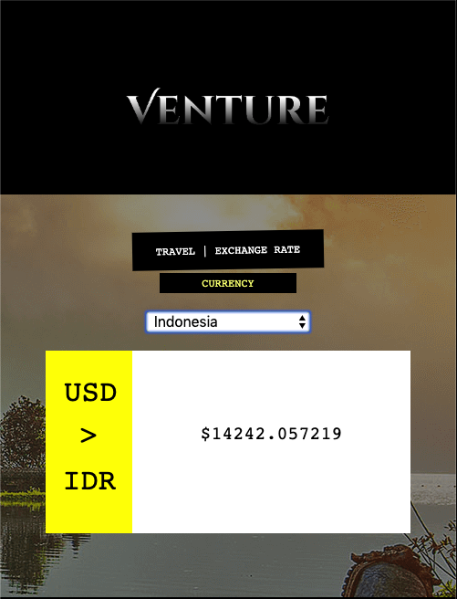
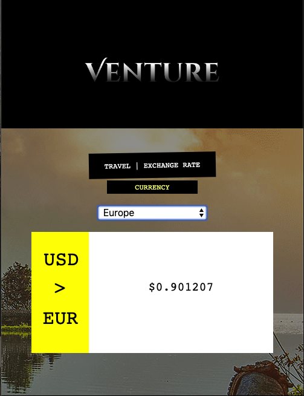

# Venture

An exchange rate application, which allows a user to calculate the exchange rate value from any country across the globe, when using the United States dollar amount.

The API pulles from exchangerate-api.com.

Things you may want to cover:

* Ruby version

* System dependencies

* Configuration

* Database creation

* Database initialization

* How to run the test suite

* Services (job queues, cache servers, search engines, etc.)

* Deployment instructions

* ...
