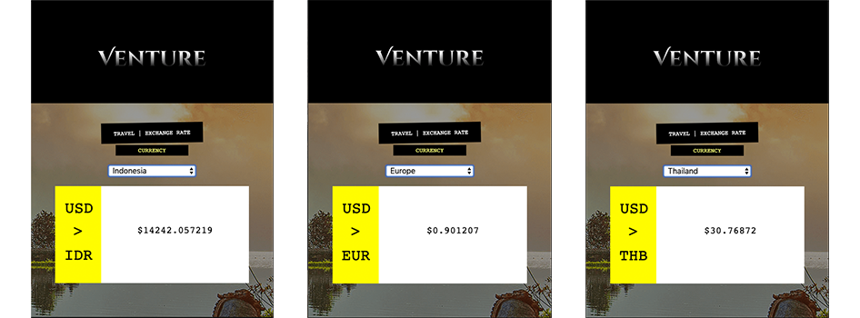

# Venture
Venture is an **exchange rate** application.

This application allows users to view in real-time the exchange rate from any country, against the base currency of the United States dollar amount.



The API pulls from exchangerate-api.com.

## How it works
+ The appication's controller is where the magic happens.
+ An API, gathers in hash-form all supported countries, along with their exchange rates

## Example of the API
```https://api.exchangerate-api.com/v4/latest/USD```

```
{
  "base": "USD",
  "date": "2019-03-20",
  "time_last_updated": 1553092232,
  "rates": {
    "USD": 1,
    "AUD": 1.408403,
    "CAD": 1.329501,
    "CHF": 0.999398,
    "CNY": 6.711962,
    "EUR": 0.880807,
    "GBP": 0.755043
    "HKD": 7.850285,
    "...": 1.311357,
    "...": 7.4731, etc. etc.
  }
}
```

## Dependencies
+ The application runs on Rails 5.2.3

## Installation
+ Fork Project!!
+ Open terminal 
+ Inside the terminal, locate the project's folder
+ Next, run the application by starting the rails server via command line: 'rails s'
+ Open a browser window to: http://localhost:3000/
+ Scroll past the introductory title, to the **exchange rate** section
+ Choose any supported country from the drop-down menu to view the exchange rate against the USD base rate.

## Ways to Contribute
+ _Have you found a new feature travelers could use? Build & submit it!_

## Version 0.1
+ This application is ran by (1) forking the project, (2) using the rails server, and (3) open a browser to view
+ The **goal** is to make this project into a swiss army knife for traveler's!
+ The **vision** is to have this app available to download from the mobile store, and to be uploaded to the user's personal device.

## Releases
+ version 0.1 - self maintaining application, whose data is pulled via API, must run rails server to power

## Relative links
[License for this project](docs/License.md)

[Code of Conduct for this project](docs/Code_of_Conduct.md)


